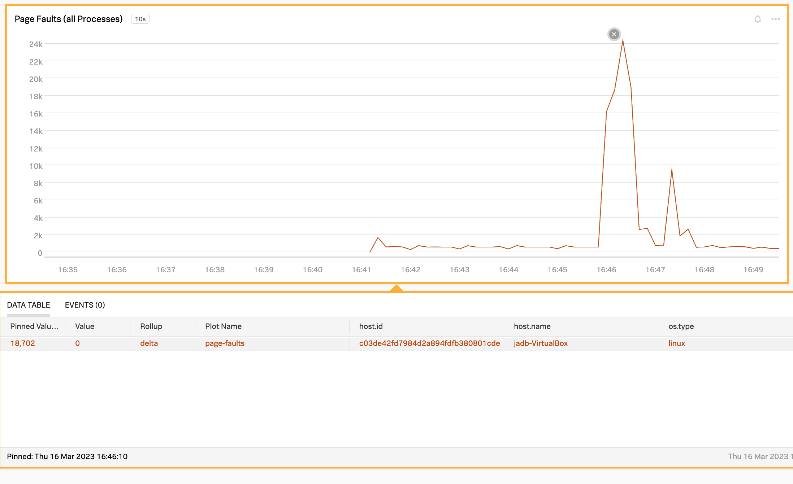
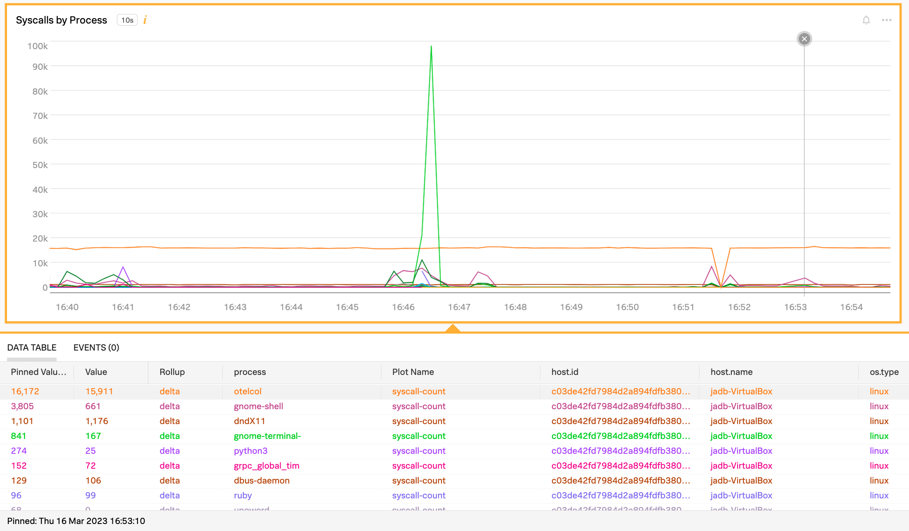

# bpftrace-forwarder

`bpftrace-forwarder` is a python program which takes as input the JSON-formatted output
from [bpftrace](https://github.com/iovisor/bpftrace) and forwards that using OTLP-GRPC
protocol to a local [OpenTelemetry Collector](https://opentelemetry.io/docs/collector/) as metrics.

Basic usage instructions are available via `-h` as:

```
% python3 ./bpftrace-forwarder.py -h
usage: bpftrace-forwarder.py [-h] [-d DIMENSION] [-v] [-t] metric

parse-trace-data reads a stream of output from bpftrace and parses out the datapoints from the stream.

positional arguments:
  metric                metric name to report

options:
  -h, --help            show this help message and exit
  -d DIMENSION, --dimension DIMENSION
                        set dimension key value (default="process")
  -v, --verbose         verbose mode, also echo input to stdout
  -t, --test            test mode, send output to console
```

The forwarder will handle either a single metric value or a set of values which are used for dimensionalizing.

An example of a single value metric would be to count the number of page faults for the system. Using the --verbose option will also echo the output through to the console.:

```
bpftrace -f json -e 'software:faults:1 { @ = count(); } interval:s:10 { print(@); clear(@); }' | python3 ./bpftrace-forwarder.py --verbose page-faults
```

An example of a multi value metric would be to count the number of syscalls for each process. In this case the metrics are reported for each process, with the additional dimension key `process` inheriting the process names as reported by bpftrace:

```
bpftrace -f json -e 'tracepoint:raw_syscalls:sys_enter { @[comm] = count(); } interval:s:10 { print(@); clear(@); }' | python3 ./bpftrace-forwarder.py --dimension process syscall-count
```

These examples above were used to generate the two views below:




